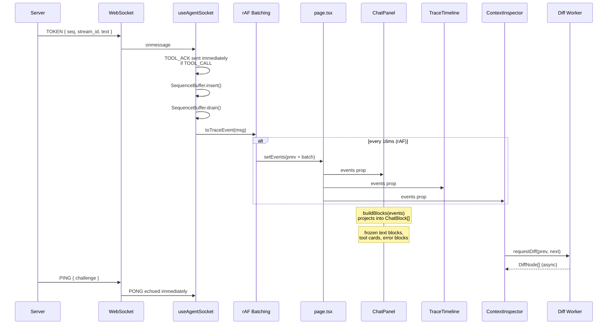
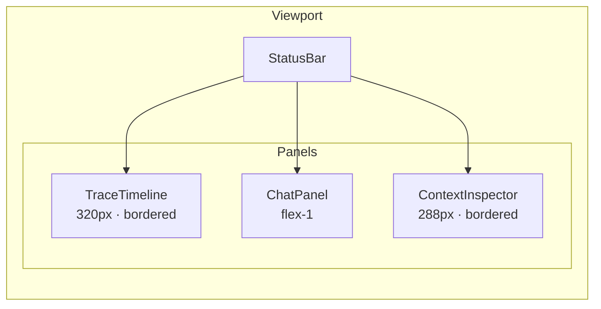
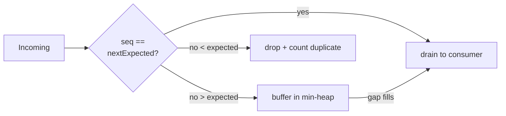
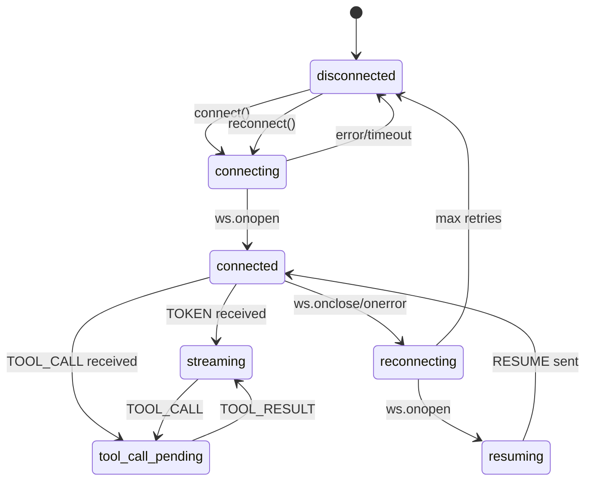
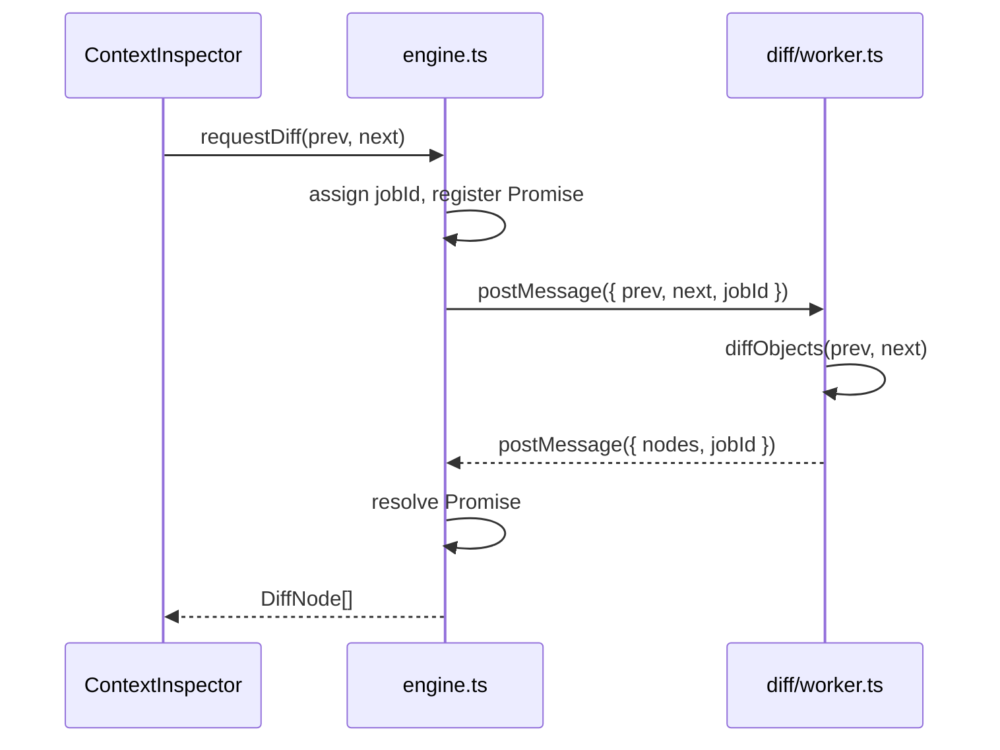

# Agent Console

**Live**: [https://myst-alche-assignment.vercel.app](https://myst-alche-assignment.vercel.app)

Next.js 16 (App Router) + React 19 + Tailwind CSS v4 observability console for the Alchemyst mock agent backend. Connects via WebSocket, renders streaming AI responses with mid-stream tool call interruptions, and survives chaos mode.

## System Architecture

```mermaid
graph TB
    subgraph Server
        WS[WebSocket<br/>ws://localhost:4747/ws]
        HTTP[HTTP<br/>GET /health, /reset, /log]
    end

    subgraph Console
        direction TB
        PAGE[page.tsx<br/>State Owner]

        subgraph WebSocket_Layer
            SOCKET[useAgentSocket<br/>Lifecycle + Heartbeat]
            BUF[SequenceBuffer<br/>Reorder + Dedup]
        end

        subgraph Diff_Engine
            DIFF_ENGINE[diff/engine.ts<br/>Worker Manager]
            DIFF_WORKER[diff/worker.ts<br/>Web Worker]
        end

        subgraph Batching
            RAF[rAF Batching<br/>pendingEventsRef]
        end

        subgraph UI
            SB[StatusBar]
            TL[TraceTimeline]
            CHAT[ChatPanel]
            CI[ContextInspector]
        end
    end

    WS -->|ServerMessage| SOCKET
    SOCKET -->|raw messages| RAF
    RAF -->|batched per frame| PAGE
    PAGE -->|TraceEvent[]| TL
    PAGE -->|TraceEvent[]| CHAT
    PAGE -->|TraceEvent[]| CI
    PAGE -->|metrics| SB
    PAGE -->|USER_MESSAGE| SOCKET
    SOCKET -->|USER_MESSAGE| WS
    PAGE -->|GET /reset| HTTP
    CI -->|requestDiff| DIFF_ENGINE
    DIFF_ENGINE -->|postMessage| DIFF_WORKER
    DIFF_WORKER -->|DiffNode[]| DIFF_ENGINE
    DIFF_ENGINE -->|Promise| CI
```

## Data Flow



## Three-Panel Layout



Three fixed-width panels in a horizontal flex row below a thin StatusBar:

- **TraceTimeline** (320px left) — scrollable event log with type filtering, keyword search, bidirectional highlight linking to chat
- **ChatPanel** (flex-1 center) — streaming text renderer with tool call cards, frozen segments, blinking cursor, quick trigger chips
- **ContextInspector** (288px right) — context snapshot history with diff view, snapshot scrubber

The parent (`page.tsx`) owns all shared state (`TraceEvent[]`, `connectionState`, `highlightedId`) and distributes it via props — no global store, no Redux, no context providers.

## WebSocket Layer

### Sequence Reordering + Dedup (`lib/ws/sequenceBuffer.ts`)



| Mechanism | Data Structure | Complexity |
|---|---|---|
| Reordering | Min-heap (`seq`-ordered) | O(log k) insert, O(1) peek |
| Deduplication | `Set<seq>` | O(1) lookup |
| Gap recovery | `flush()` on STREAM_END + 4s stall timer | O(k log k) |

Messages enter via `insert(msg)`. If `msg.seq === nextExpected`, it drains immediately and cascades through any contiguous buffered messages. Otherwise it sits in the heap until the gap fills. Duplicates (same seq already in the Set) are silently dropped and counted via `duplicateDrops`.

### WebSocket Hook (`hooks/useAgentSocket.ts`)

State machine:



Key behaviors:

- **TOOL_ACK sent before buffer processing** — the socket handler sends `TOOL_ACK` on `TOOL_CALL` receipt before the message enters the sequence buffer. This prevents the server's 5-second TOOL_ACK timeout from expiring while the message waits in the reorder buffer.
- **PONG echoed immediately** on `PING` receipt. Corrupt PINGs (`challenge: ""`) handled without crash.
- **RESUME as first message** on reconnection, using `lastProcessed` from the sequence buffer (tracks DOM consumption, not socket arrival).
- **Exponential backoff**: 500ms, 1s, 2s, 4s, 10s (capped). Resets on successful connection.
- **Stall recovery interval** (4s) force-flushes the buffer if it gets stuck on a seq that will never arrive (chaos mode drop).

## Chat Rendering — BuildBlocks Projection

The `ChatPanel` does not render `TraceEvent[]` directly. `buildBlocks(events)` projects the flat event stream into a stable `ChatBlock[]`:

```mermaid
graph TD
    EV[TraceEvent[]] --> BB[buildBlocks]
    BB --> TB[TextBlock<br/>accumulates TOKENs]
    BB --> TLB[ToolBlock<br/>tool call card]
    BB --> EB[ErrorBlock]
    TB -->|frozen on TOOL_CALL/ERROR| FT[Frozen TextBlock]
    TLB -->|updated by| TR[TOOL_RESULT]
    FT -->|new stream continues| NT[New TextBlock]
```

| Event | Block action |
|---|---|
| `TOKEN` | Append to active `TextBlock` (or create one) |
| `TOOL_CALL` | Freeze active `TextBlock`, create `ToolBlock(pending)` |
| `TOOL_RESULT` | Update matching `ToolBlock` → `completed` |
| `STREAM_END` | Freeze active `TextBlock` |
| `ERROR` | Freeze active `TextBlock`, create `ErrorBlock` |

**Key invariants:**
- Frozen blocks never mutate — once frozen, their content is stable. React skips reconciliation on these nodes.
- Each frozen block is assigned a deterministic key (`t-N` for text, `c-<call_id>` for tool calls), keeping them mounted across re-renders.
- Only the active (unfrozen) `TextBlock` accumulates new tokens between renders.
- This prevents layout shift: frozen DOM is stable, new content appends below.

## Diff Engine — Web Worker

Context snapshot diffs run in a **Web Worker** (`lib/diff/worker.ts`) to avoid blocking the main thread on 500KB+ payloads (the `large_context` script generates a 64-table database schema).



- **`lib/diff/types.ts`** — `DiffNode`, `DiffKind`, request/response types
- **`lib/diff/worker.ts`** — recursive `diffObjects` that walks two JSON trees, comparing by key, depth (≤3), `JSON.stringify` deep equality. Returns a tree of `DiffNode` with `added`, `removed`, `changed`, `same` annotations
- **`lib/diff/engine.ts`** — singleton worker manager. Lazily creates the worker on first `requestDiff()` call. Maps `jobId` to pending Promise resolvers. `destroyWorker()` terminates on unmount

The `ContextInspector` calls `requestDiff(prev, next)` in a `useEffect` whenever the selected snapshot changes. A `cancelledRef` guards against stale responses from rapid snapshot scrubbing.

## rAF State Batching (`page.tsx`)

Without batching, every `TOKEN` (30-80ms apart) triggers a React render on all three panels. Incoming messages are pushed to a `pendingEventsRef` array on socket receipt. A `requestAnimationFrame` callback drains the array and calls `setEvents()` once per frame (~16ms). A `scheduledRef` boolean prevents queueing duplicate rAFs — rapid bursts coalesce into a single render.

```typescript
// Simplified from page.tsx
pendingEventsRef.current.push(toTraceEvent(msg));
if (scheduledRef.current) return;
scheduledRef.current = true;
rafIdRef.current = requestAnimationFrame(() => {
  scheduledRef.current = false;
  const batch = pendingEventsRef.current.splice(0);
  if (batch.length > 0) {
    setEvents((prev) => [...prev, ...batch]);
  }
});
```

## StatusBar Observability

A thin top bar spanning all three panels shows real-time connection and protocol metrics:

| Metric | Source | Description |
|---|---|---|
| Transport pill | `connectionState` | Color-coded: green/sky/orange/red |
| Reconnects | `reconnectCount` | Number of reconnections (highlighted if >0) |
| Events | `events.length` | Total trace events accumulated |
| Tokens | `totalTokens` | Total TOKEN messages |
| Seq | `lastSeq` | Highest seq received |
| Expected | `expectedSeq` | Next expected seq from buffer |
| Drops | `duplicateDrops` | Duplicate messages dropped (highlighted if >0) |
| Heartbeat | `heartbeatLatency` | PING→PONG processing delay (ms) |
| Throughput | sliding 2s window | Events/tokens per second |
| Streams | active stream count | Currently streaming stream_ids |
| Buffer | `bufferSize` | Messages waiting in reorder buffer |
| Pending tools | tool count | In-flight tool calls (pulsing) |

Sub-components: `TransportPill` · `MetricBadge` · `StatusActions`.

## Auto Suite

The "Run Auto Suite" button in `StatusActions` cycles through all 7 server response scripts by sending trigger messages sequentially (800ms gap):

| Message sent | Script triggered |
|---|---|
| `hello` | Simple Greeting |
| `generate quarterly report` | Report Summary |
| `analyze correlation between metrics` | Multi-Tool Analysis |
| `lookup deployment SLA requirements` | Knowledge Base Lookup |
| `full database schema with context` | Large Context Load |
| `write comprehensive document with detailed analysis` | Long Detailed Response |
| `how's the weather today` | Default Response |

The button disables while running and when disconnected.

## Bidirectional Highlight

`ChatPanel` and `TraceTimeline` share a `highlightedId` prop + `onHighlight` callback from the parent. Clicking a tool call card in chat calls `onHighlight(call_id)`, which sets `highlightedId` in `page.tsx`. The timeline responds by scrolling to the matching `TOOL_CALL` row and highlighting it (and vice versa). Uses `data-id` DOM attributes and a `ref` guard to prevent scroll loops.

## ContextInspector

Displays `CONTEXT_SNAPSHOT` events grouped by `context_id`. Features:

- **Context selector** — dropdown to pick which context stream to inspect
- **Snapshot scrubber** — left/right arrows to step through snapshot history
- **Diff view** — when multiple snapshots exist, shows a tree diff with `+` (added), `-` (removed), `~` (changed), with old values struck through and new values in green
- **Depth-limited** — recurses 3 levels deep to handle large objects without stack overflow

## Protocol

### Client Messages

| Type | Payload | When |
|---|---|---|
| `USER_MESSAGE` | `{ content: string }` | User submits input |
| `PONG` | `{ challenge: string }` | Echoes PING's `challenge` |
| `TOOL_ACK` | `{ call_id: string }` | On TOOL_CALL receipt (pre-buffer) |
| `RESUME` | `{ last_seq: number }` | First message on reconnection |

### Server Messages

| Type | Fields | Notes |
|---|---|---|
| `TOKEN` | `seq, stream_id, content` | Streamed 30-80ms apart |
| `TOOL_CALL` | `seq, call_id, tool_name, args` | Pauses stream for that `stream_id` |
| `TOOL_RESULT` | `seq, call_id, result` | Resumes paused stream |
| `CONTEXT_SNAPSHOT` | `seq, context_id, data` | Start + mid-response context changes |
| `PING` | `seq, challenge` | Heartbeat ~12s interval |
| `STREAM_END` | `seq, stream_id` | Response complete |
| `ERROR` | `seq, code, message` | May arrive at any point |

Every server message includes a monotonic `seq` for ordering.

## File Map

```
agent-console/
├── app/
│   ├── globals.css          — Tailwind v4 theme (Notion design tokens)
│   ├── layout.tsx           — Root layout (Geist font, metadata)
│   └── page.tsx             — Three-panel layout + state ownership
├── components/
│   ├── chat/
│   │   └── ChatPanel.tsx    — Streaming chat + buildBlocks projection
│   ├── context/
│   │   └── ContextInspector.tsx — Snapshot diff viewer
│   ├── timeline/
│   │   └── TraceTimeline.tsx — Event log with filter/search/highlight
│   └── ui/
│       ├── MetricBadge.tsx   — Reusable metric display
│       ├── StatusActions.tsx — Disconnect/Reconnect/Reset/Auto Suite
│       ├── StatusBar.tsx     — Observability metrics bar
│       ├── TraceLogEntry.tsx — Trace event row
│       └── TransportPill.tsx — Connection state indicator
├── hooks/
│   └── useAgentSocket.ts    — WebSocket lifecycle + heartbeat
├── lib/
│   ├── diff/
│   │   ├── engine.ts        — Worker manager + requestDiff()
│   │   ├── types.ts         — DiffNode, DiffKind, DiffRequest
│   │   └── worker.ts        — Web Worker: recursive tree diff
│   └── ws/
│       ├── config.ts        — WS_URL + HTTP_BASE config
│       ├── sequenceBuffer.ts — Min-heap reorder + Set dedup
│       └── types.ts         — Protocol types (ServerMessage, etc.)
├── __tests__/
│   ├── buildBlocks.test.ts  — Chat projection test (10 cases)
│   └── sequenceBuffer.test.ts — Buffer test (13 cases)
├── vitest.config.ts
└── CLAUDE.md                — Points to AGENTS.md
```

## Testing

23 test cases across 2 files using Vitest:

```bash
npm run test    # vitest run
```

| Test file | Coverage |
|---|---|
| `__tests__/sequenceBuffer.test.ts` (13) | Empty buffer, in-order, out-of-order, reversed, dedup, flush, reset, large burst, mixed types |
| `__tests__/buildBlocks.test.ts` (10) | Text accumulation, stream separation, tool call freeze/resume, STREAM_END, ERROR, rapid tool calls, multiple sequential tools |

## Commands

```bash
npm run dev      # next dev on :3000
npm run build    # next build (lint + typecheck)
npm run lint     # eslint
npm run start    # next start (production)
npm run test     # vitest run
```

Run the reference backend (from repo root):

```bash
docker build -t agent-server ./agent-server
docker run -p 4747:4747 agent-server               # normal
docker run -p 4747:4747 agent-server --mode chaos   # chaos
```

See `agent-server/README.md` for trigger keywords and protocol details.
